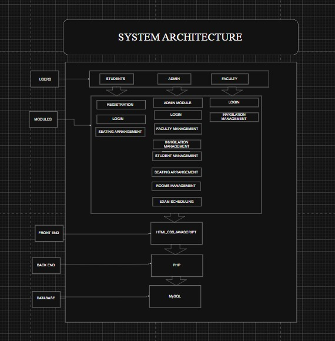
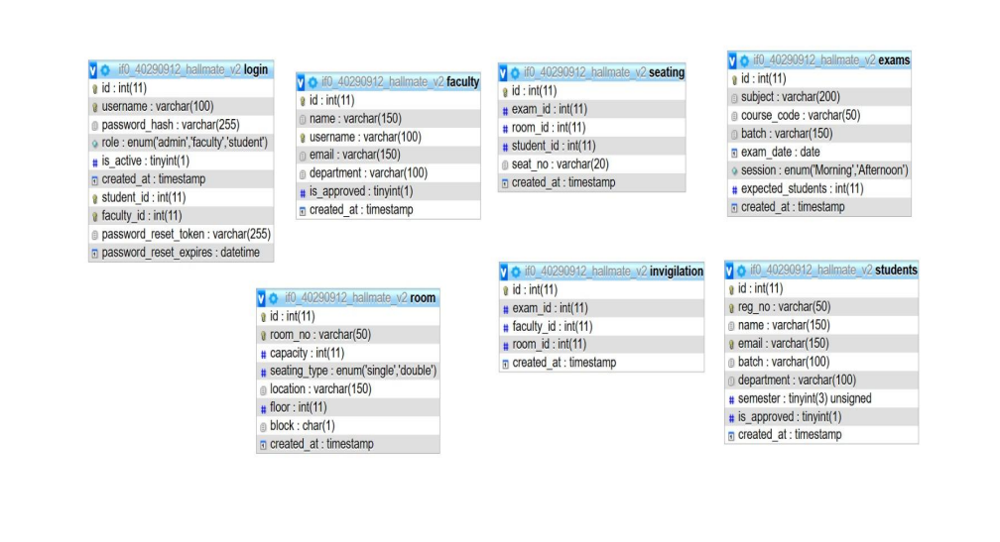
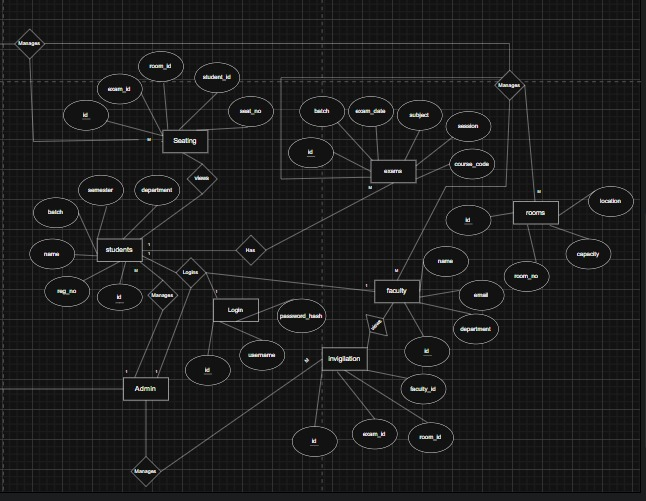
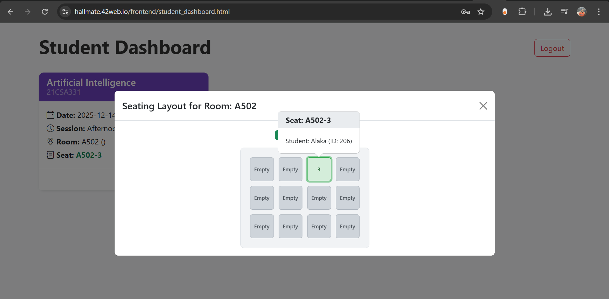
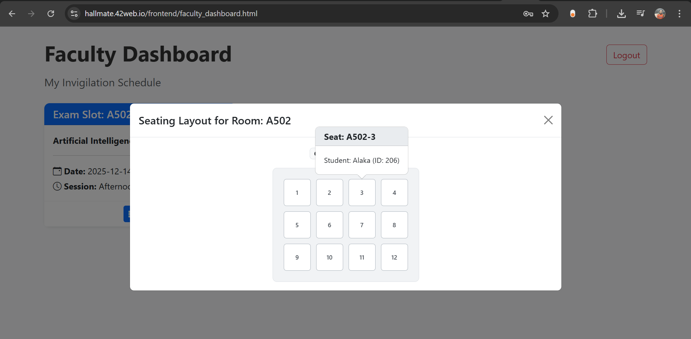

# Hallmate – Smart Examination Hall & Seating Management System

### PHP • MySQL • HTML • CSS • Bootstrap • JavaScript • AJAX • PHPMailer • Interactive Seat Layout

---

## Overview 

**Hallmate** is a full-stack web-based solution designed to automate and streamline examination hall allocation and seating management in academic institutions. It eliminates human errors, reduces administrative workload, and introduces a fully digital workflow for students, faculty, and administrators.

The system features an intelligent seating allocation engine, interactive seat layouts, automatic invigilator assignment, and Outlook-ready email notifications via **PHPMailer**.

This project demonstrates real-world full-stack development, database design, automation logic, secure authentication, and responsive UI engineering.

---

## System Components 

| Component / Module            | Description                                                    |
| ----------------------------- | -------------------------------------------------------------- |
| **Admin Dashboard**           | Manages students, faculty, rooms, halls, and examinations      |
| **Student Dashboard**         | Displays hall details + highlighted seat in interactive layout |
| **Faculty Dashboard**         | Shows hall-wise student placements & invigilation duties       |
| **Seating Allocation Engine** | Intelligent rule-based seating arrangement logic               |
| **PHPMailer**                 | Auto-emails login info & approval messages                     |
| **MySQL Database**            | Stores all exam, seating, hall, and user data                  |
| **Responsive UI**             | Built using Bootstrap and custom components                    |

---

## Features

### Student Features 

* Login authentication with hashed credentials
* View exam schedule, hall number, and assigned seat
* Interactive seat layout (similar to BookMyShow) with personal seat highlighted
* Email notification upon account approval
* Mobile-responsive dashboard

### Faculty Features 

* View assigned invigilation roles
* Access hall-wise seating arrangement
* See list of all students seated in their hall
* View interactive seating map
* Email notification when account is activated

### Admin Features 

* Add/update/delete students, faculty, halls, rooms, and exams
* Approve new accounts and trigger automated email notifications
* Generate exam-wise seating plans
* Automatic invigilator assignment based on room capacity
* Download/print seating charts
* View real-time seating summary

### Seating Allocation Engine

* Automatically separates students of similar batches to reduce malpractice
* Supports single-seater and double-seater room layouts
* Alternates student placement using custom index rules
* Fills rooms optimally based on seat capacity
* Auto-generates unique seat numbers (e.g., D101-01, D101-02, …)
* Assigns invigilators dynamically

---

## System Architecture

---

## Database Schema

---

## ER Diagram

---

## **Interactive Seating Layout** 

### **Student View**
 

---

### **Faculty View**

---

## Applications 

* University & college exam automation
* Competitive exam centers
* Digital seating management
* Faculty invigilation planning
* Any large-scale examination system

---

## Future Enhancements 

* QR-based student attendance
* AI-based hall optimization engine
* WhatsApp / SMS alerts
* Fully independent mobile app
* Enhanced admin analytics dashboard
* PDF export for seating charts

---

## Contributors 

- Ajit Guru S
- Arjun Ganesan 
- Abhirami R
- Alaka Nanda
- Gayathri k

---
